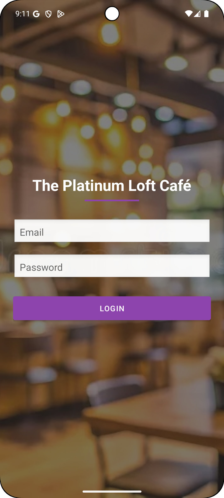
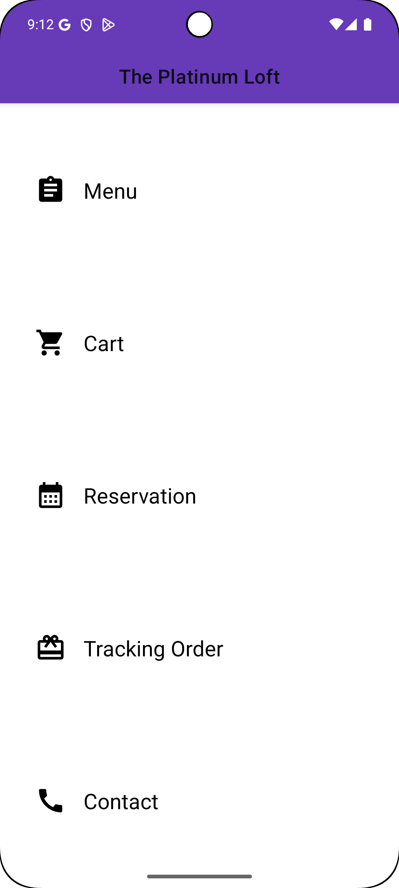
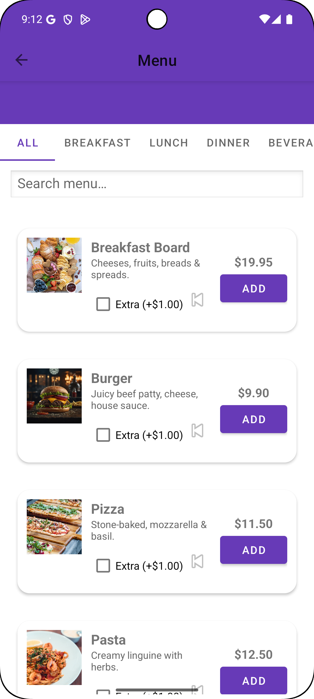
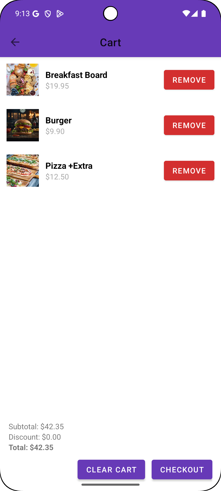
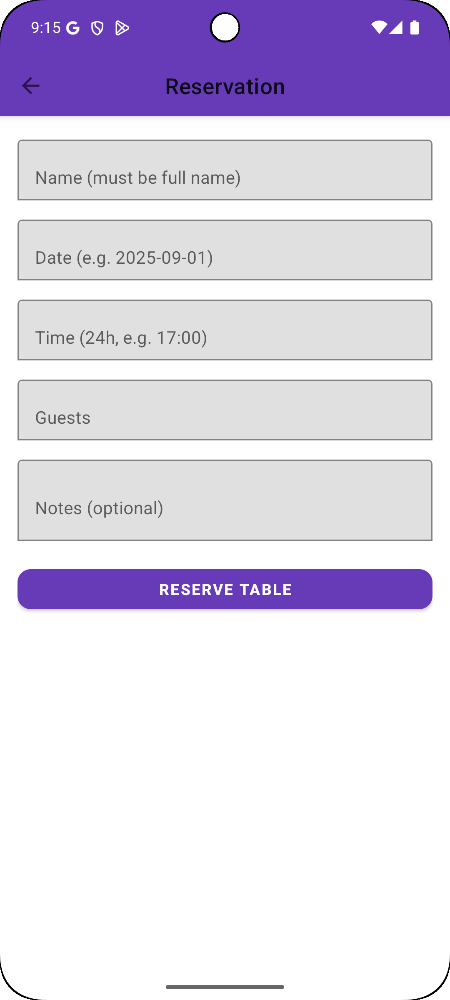
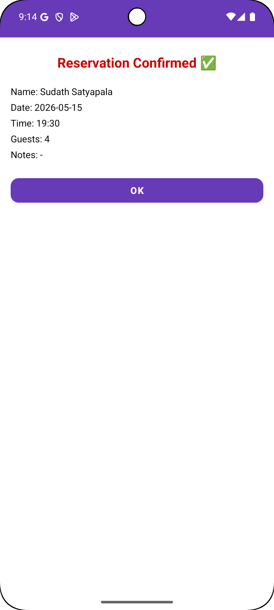
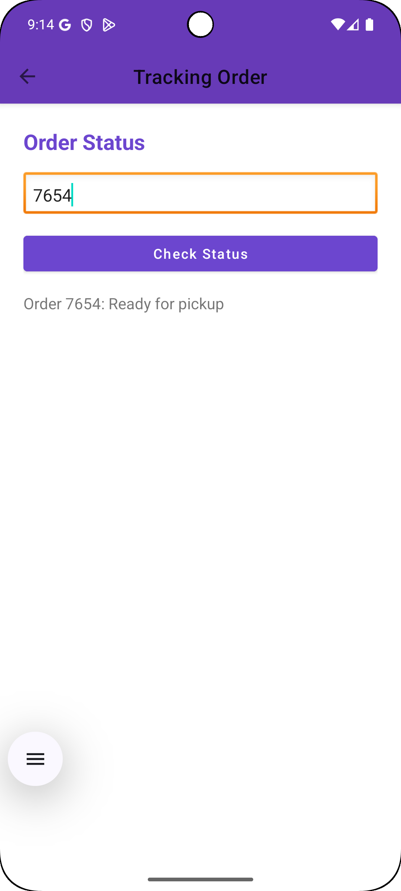
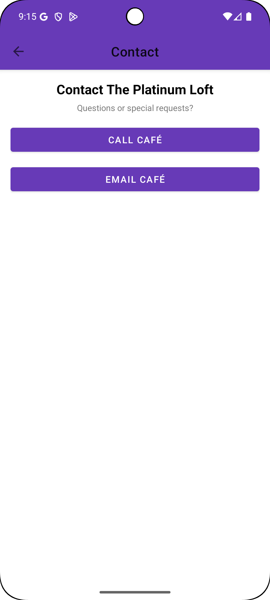

# The Platinum Loft - Android Restaurant App

The Platinum Loft is a smart restaurant and café mobile application developed using Java and XML in Android Studio. This project was created as part of my Computer Science degree work to demonstrate mobile application development, user interface design, and basic ordering system functionality.

## Project Overview

The main purpose of this application is to provide a simple and user-friendly digital restaurant experience. Users can browse menu items, add food items to the cart, make table reservations, track orders, and contact the restaurant easily.

This project focuses on clear navigation, attractive UI design, and practical mobile app features suitable for a modern café or restaurant.

## Features

- User-friendly login/home screen
- Digital food menu
- Food item details
- Add to cart function
- Cart total calculation
- Table reservation form
- Reservation confirmation screen
- Order tracking screen
- Contact page with phone and email options
- Clean and simple Android UI design

## Technologies Used

- Java
- XML
- Android Studio
- Material Design Components
- RecyclerView
- CardView
- Intent
- Fragment / Activity-based navigation
- Gradle

## How to Run the Project

1. Download or clone this repository.

```bash
git clone https://github.com/monali-pabasara/the-platinum-loft-android-app.git
```

2. Open the project in Android Studio.

3. Wait for Gradle to sync successfully.

4. Connect an Android device or start an emulator.

5. Click the Run button to launch the application.

## Requirements

- Android Studio
- Java
- Gradle
- Android Emulator or physical Android device

## My Role

I designed and developed the mobile application, including the user interface, screen navigation, menu display, cart logic, reservation form, and testing using the Android emulator.

## Screenshots

| Home Screen | Main Menu Screen | Food Menu Screen |
|------------|------------------|------------------|
|  |  |  |

| Cart Screen | Reservation Screen | Reservation Confirmation |
|------------|--------------------|--------------------------|
|  |  |  |

| Order Tracking | Contact Screen |
|---------------|----------------|
|  |  |

## What I Learned

Through this project, I improved my understanding of Android mobile application development using Java and XML. I learned how to create multiple screens, design user-friendly layouts, manage user input, display menu items, calculate cart totals, and connect different parts of an application together.

I also gained practical experience in testing the application using the Android emulator and organizing a project professionally for GitHub.

## Future Improvements

- Add Firebase authentication
- Add online payment option
- Add real-time order status updates
- Add admin panel for restaurant staff
- Improve UI animations and responsiveness
- Add user profile and order history features

## Author

**Monali Pabasara**  
Computer Science and Networking Undergraduate  
Singapore
